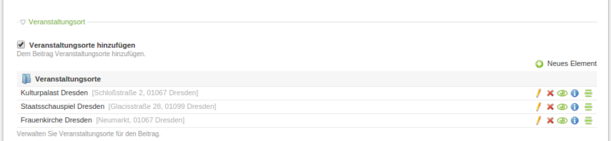
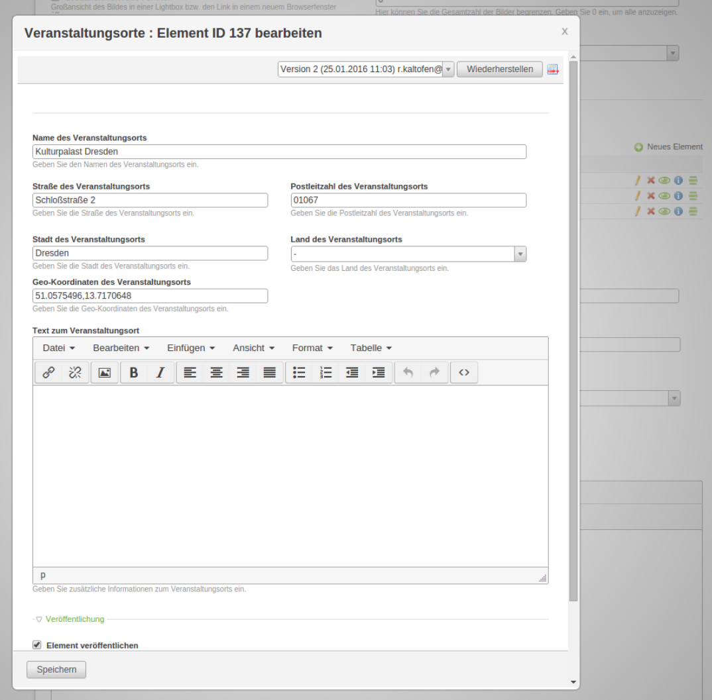

# FieldPalette

FieldPalette is a contao widget like [MultiColumnWizard] (https://github.com/menatwork/MultiColumnWizard) with its own database table.
The fieldpalette configuration is based on Contao's [Data Container Arrays](https://docs.contao.org/books/api/dca/index.html).
Unlike MultiColumnWizard, fields are stored flat into 'tl_fieldpalette' table and synced with its parent field.


*FieldPalette Wizard - ListView*


*FieldPalette Wizard - Edit item*

## Technical instruction

This example shows the setup of an fieldpalette field within tl_news by using it within an subpalette. That example is available within the module [heimrichhannot/contao-plus] (https://packagist.org/packages/heimrichhannot/contao-news_plus).

```
#/system/modules/[MyModule]/dca/tl_news.php

$dc = &$GLOBALS['TL_DCA']['tl_news'];

/**
 * Selectors
 */
$dc['palettes']['__selector__'][] = 'addVenues';

/**
 * Subpalettes
 */
$dc['subpalettes']['addVenues'] = 'venues';

/**
 * Fields
 */
$arrFields = array
(
	// venue
	'addVenues'           => array
	(
		'label'     => &$GLOBALS['TL_LANG']['tl_news']['addVenues'],
		'exclude'   => true,
		'inputType' => 'checkbox',
		'eval'      => array('submitOnChange' => true),
		'sql'       => "char(1) NOT NULL default ''",
	),
	'venues'              => array
	(
		'label'        => &$GLOBALS['TL_LANG']['tl_news']['venues'],
		'inputType'    => 'fieldpalette',
		'foreignKey'   => 'tl_fieldpalette.id',
		'relation'     => array('type' => 'hasMany', 'load' => 'eager'),
		'sql'          => "blob NULL",
		'fieldpalette' => array
		(
			'list'     => array
			(
				'label' => array
				(
					'fields' => array('venueName', 'venueStreet', 'venuePostal', 'venueCity'),
					'format' => '%s <span style="color:#b3b3b3;padding-left:3px">[%s, %s %s]</span>',
				),
			),
			'palettes' => array
			(
				'default' => 'venueName,venueStreet,venuePostal,venueCity,venueCountry,venueSingleCoords,venuePhone,venueFax,venueEmail,venueWebsite,venueText',
			),
			'fields'   => array
			(
				'venueName'         => array
				(
					'label'     => &$GLOBALS['TL_LANG']['tl_news']['venueName'],
					'exclude'   => true,
					'search'    => true,
					'inputType' => 'text',
					'eval'      => array('maxlength' => 255, 'tl_class' => 'long'),
					'sql'       => "varchar(255) NOT NULL default ''",
				),
				'venueStreet'       => array
				(
					'label'     => &$GLOBALS['TL_LANG']['tl_news']['venueStreet'],
					'exclude'   => true,
					'search'    => true,
					'inputType' => 'text',
					'eval'      => array('maxlength' => 255, 'tl_class' => 'w50'),
					'sql'       => "varchar(255) NOT NULL default ''",
				),
				'venuePostal'       => array
				(
					'label'     => &$GLOBALS['TL_LANG']['tl_news']['venuePostal'],
					'exclude'   => true,
					'search'    => true,
					'inputType' => 'text',
					'eval'      => array('maxlength' => 32, 'tl_class' => 'w50'),
					'sql'       => "varchar(32) NOT NULL default ''",
				),
				'venueCity'         => array
				(
					'label'     => &$GLOBALS['TL_LANG']['tl_news']['venueCity'],
					'exclude'   => true,
					'filter'    => true,
					'search'    => true,
					'sorting'   => true,
					'inputType' => 'text',
					'eval'      => array('maxlength' => 255, 'tl_class' => 'w50'),
					'sql'       => "varchar(255) NOT NULL default ''",
				),
				'venueCountry'      => array
				(
					'label'     => &$GLOBALS['TL_LANG']['tl_news']['venueCountry'],
					'exclude'   => true,
					'filter'    => true,
					'sorting'   => true,
					'inputType' => 'select',
					'options'   => System::getCountries(),
					'eval'      => array('includeBlankOption' => true, 'chosen' => true, 'tl_class' => 'w50'),
					'sql'       => "varchar(2) NOT NULL default ''",
				),
				'venueSingleCoords' => array
				(
					'label'         => &$GLOBALS['TL_LANG']['tl_news']['venueSingleCoords'],
					'exclude'       => true,
					'search'        => true,
					'inputType'     => 'text',
					'eval'          => array('maxlength' => 64),
					'sql'           => "varchar(64) NOT NULL default ''",
					'save_callback' => array
					(
						array('tl_news_plus', 'generateVenueCoords'),
					),
				),
				'venueText'         => array
				(
					'label'     => &$GLOBALS['TL_LANG']['tl_news']['venueText'],
					'exclude'   => true,
					'search'    => true,
					'inputType' => 'textarea',
					'eval'      => array('rte' => 'tinyMCE', 'tl_class' => 'clr'),
					'sql'       => "text NULL",
				),
			),
		),
	),
);

$dc['fields'] = array_merge($dc['fields'], $arrFields);
```

## Features

### Widgets

Name | Description
---- | -----------
fieldpalette | The FieldPaletteWizard renders the tl_fieldpalette items and provide crud functionality within its parent record (e.g. tl_news).

### Fields

tl_fieldpalette:

Name | Description
---- | -----------
id | autoincrement unique identifiere
pid | id of the parent entry
ptable | parent table name (e.g. tl_news)
pfield | parent field name (e.g. tl_news.venues)
sorting | the sorting value
published | the published state (1 = published) 
start | timestamp from where the element is published 
stop | timestamp until the element is published

### Form Callbacks

tl_fieldpalette:

Type | Description
---- | -----------
oncreate_callback | Get fieldpalette key from request, check if the parent table is active within Fieldpalette Registry and set the pfield to tl_fieldpalette item. 
onsubmit_callback | Update/Sync parent fieldpalette item value (for example tl_news.venues) when tl_fieldpalette entries were updated.
oncut_callback | Update/Sync parent fieldpalette item value (for example tl_news.venues) when tl_fieldpalette entries were sorted.
ondelete_callback | Update/Sync parent fieldpalette item value (for example tl_news.venues) when tl_fieldpalette entries were deleted.


### Hooks

Name | Arguments | Description
---- | --------- | -----------
loadDataContainer | $strTable | Register fields from parent datacontainer (like tl_news) to tl_fieldpalette and disable fieldpalette support from back end modules where no fieldpalette fields exists (see: initializeSystem Hook). 
initializeSystem | - | Enable tl_fieldpalette table within all back end modules.	
executePostActions | $strAction, \DataContainer $dc | Add refreshFieldPaletteField ajax action that return the updated FieldPaletteWizard content.

## Restrictions

* only supports DC_Table DataContainers
